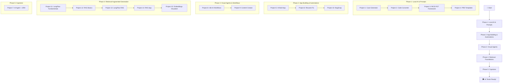

# 🤖 AI Tester Blueprint

<div align="center">


**A comprehensive hands-on course for QA Engineers to master AI-powered testing tools and techniques.**

*Learn to build local AI tools, prompt engineering frameworks, automation accelerators, AI agents, visual workflows, RAG systems, and full-stack applications—all with a tester-first mindset.*

---

[🚀 Getting Started](#-getting-started) • [📚 Projects](#-projects) • [🛠️ Tech Stack](#️-tech-stack) • [🎯 Learning Path](#-learning-path)

</div>

---

## 📖 About This Course

The **AI Tester Blueprint** is a project-based course designed to transform QA engineers into AI-powered testing professionals. Across **15 hands-on projects**, you'll progress from local LLM basics to building production-grade AI agents and robust document retrieval systems. Each project introduces new concepts in:

- 🧠 **Local LLM Integration** — Running AI models on your machine using Ollama
- 🏗️ **Prompt Engineering** — Crafting effective prompts using RICE-POT & B.L.A.S.T. frameworks
- 🔄 **Code Conversion** — Migrating legacy test suites to modern frameworks
- 📝 **Test Case Generation** — AI-assisted test case creation from user stories and PRDs
- 🤖 **AI Agents** — Building autonomous AI agents that integrate with JIRA & LLMs
- 🚀 **Full-Stack Dev with AI** — Using AI coding assistants (Claude Code) to build real apps
- 📄 **Resume & Career Tools** — AI-powered resume optimization for QA professionals
- 🔗 **No-Code Automation** — Visual workflow automation with n8n
- 📚 **Retrieval-Augmented Generation (RAG)** — Giving AI access to your private company data
- 🧩 **Flow Engineering** — Building visual AI apps with LangFlow

---

## 🚀 Getting Started

### Prerequisites

Before starting any project, ensure you have the following installed:

| Tool | Purpose | Installation |
|------|---------|--------------|
| **Ollama** | Local LLM Engine | [ollama.com](https://ollama.com/) |
| **Node.js** (v18+) | JavaScript Runtime | [nodejs.org](https://nodejs.org/) |
| **Python** (3.10+) | Backend Development | [python.org](https://python.org/) |
| **Java** (JDK 11+) | Selenium Projects | [adoptium.net](https://adoptium.net/) |
| **Maven** | Java Build Tool | [maven.apache.org](https://maven.apache.org/) |
| **n8n** | No-Code Automation | `npm install -g n8n` |
| **LangFlow** | Visual RAG Pipelines | `pip install langflow` |

### LLM Models Required

Pull the following models based on the project you're working on:

```bash
# For Project 1 - Test Case Generator
ollama pull llama3.2

# For Project 2 - Selenium to Playwright Converter
ollama pull codellama

# For Project 7 - TestPlan AI Agent (Local mode)
ollama pull llama3.2
```

---

## 📚 Projects

### 🔹 Project 1: Local Test Case Generator

> **AI-powered test case generation from User Stories using Llama 3.2**

| Aspect | Details |
|--------|---------|
| **Focus** | Test Case Generation, Prompt Engineering |
| **Tech Stack** | Python (FastAPI), Vanilla JS, Ollama |
| **LLM Model** | Llama 3.2 |
| **Key Concept** | B.L.A.S.T. Protocol for Agentic AI |

📂 **[View Project Details →](./Project_01_LocalTestCaseGenerator/README.md)**

---

### 🔹 Project 2: Selenium to Playwright Converter

> **AI-powered migration tool: Convert Selenium Java to Playwright TypeScript**

| Aspect | Details |
|--------|---------|
| **Focus** | Code Conversion, Legacy Migration |
| **Tech Stack** | React (Vite), Node.js, TailwindCSS, Monaco Editor |
| **LLM Model** | CodeLlama |
| **Key Concept** | Modern UI with Glassmorphism Design |

📂 **[View Project Details →](./Project_02_Selenium2PlaywrightLocalLLM/README.md)**

---

### 🔹 Project 3: RICE-POT Prompt Framework (Selenium)

> **Enterprise-grade Selenium framework generated using the RICE-POT prompting technique**

| Aspect | Details |
|--------|---------|
| **Focus** | Prompt Engineering, Framework Generation |
| **Tech Stack** | Java, Selenium, Maven, TestNG |
| **Key Concept** | RICE-POT Prompt Framework |
| **Target App** | Salesforce Login Page |

**RICE-POT Framework:**
**R**ole • **I**nstructions • **C**ontext • **E**xample • **P**arameters • **O**utput • **T**one

📂 **[View Project Details →](./Project_03_RICE_POT_PROMPT_SeleniumFramework/README.md)**

---

### 🔹 Project 4: Local LLM Prompt Templates

> **Production-ready prompt templates for test case generation from PRDs**

| Aspect | Details |
|--------|---------|
| **Focus** | Prompt Templates, PRD Analysis |
| **Tech Stack** | Playwright (TypeScript), Markdown Templates |
| **Key Concept** | Context-Constrained Prompting |

📂 **[View Project Folder →](./Project_04_LocalLLM_PROMPT_TEMPLATE/)**

---

### 🔹 Project 5: Job Board Assistant (AI-Built Full-Stack App)

> **A Kanban-style job application tracker — built entirely using Claude Code AI assistant**

| Aspect | Details |
|--------|---------|
| **Focus** | AI-Assisted Full-Stack Development |
| **Tech Stack** | React 19, TypeScript, Vite, Tailwind CSS 4 |
| **Key Concept** | Building production apps with AI coding assistants |

📂 **[View Project Details →](./Project_05_ClaudeCodeJobAssistantBoard/job-board-assistant/README.md)**

---

### 🔹 Project 6: AI Resume Fix for LinkedIn

> **AI-powered resume optimization tailored for QA/Testing professionals**

| Aspect | Details |
|--------|---------|
| **Focus** | Resume Optimization, Career Tools |
| **Tech Stack** | AI Prompts, DOCX/PDF Templates |
| **Key Concept** | AI-driven resume rewriting for QA roles |

📂 **[View Project Folder →](./Project_06_ResumeFix_LinkedIn/)**

---

### 🔹 Project 7: TestPlan AI Agent + JIRA Integration

> **Full-stack AI agent that automates test plan creation from JIRA tickets using LLMs**

| Aspect | Details |
|--------|---------|
| **Focus** | AI Agents, JIRA Integration, Full-Stack Development |
| **Tech Stack** | Node.js (Express), React (Vite), TypeScript, Tailwind CSS |
| **LLM Providers** | Groq API (Cloud) + Ollama (Local) |
| **Key Concept** | A.N.T. 3-Layer Architecture |

📂 **[View Project Details →](./Project_07_TestPlan_AI_AGENT_JIRA/AGENTS.md)**

---

### 🔹 Project 8: n8n AI Workflow Automation

> **Building multi-tool AI automation pipelines connecting APIs, Jira, and Google Sheets**

| Aspect | Details |
|--------|---------|
| **Focus** | No-Code AI Agents, Workflow Automation |
| **Tech Stack** | n8n, Groq API, Jira API, Google Docs/Sheets |
| **Key Concept** | Visual workflow automation for testers |

📂 **[View Project Folder →](./Project_08_n8n_Learning/)**

---

### 🔹 Project 9: Content Creation Agent (n8n)

> **Automated daily LinkedIn post generation and scheduling**

| Aspect | Details |
|--------|---------|
| **Focus** | Content Automation, Scheduled Workflows |
| **Tech Stack** | n8n, APIs |
| **Key Concept** | Task automation on a chronological schedule |

📂 **[View Project Folder →](./Project_09_Content-Creation-n8n/)**

---

### 🔹 Project 10: BugSnap

> **Enhancing bug reports with instant snapshots and annotations**

| Aspect | Details |
|--------|---------|
| **Focus** | Bug Reporting Tools |
| **Tech Stack** | Markdown, Web Technologies |
| **Key Concept** | Streamlined QA reporting flows |

📂 **[View Project Folder →](./Project_10_BugSnap-BugReportEnhancer/)**

---

### 🔹 Project 11: LangFlow Fundamentals

> **LangFlow basics, starter QA agents, and beginner visual AI pipelines**

| Aspect | Details |
|--------|---------|
| **Focus** | LangFlow Basics, Prompt Flows, QA Starter Agents |
| **Tech Stack** | LangFlow, Groq, Prompt Templates, API Request |
| **Key Concept** | Building simple visual AI flows before moving to RAG |

📂 **[View Project Folder →](./Project_11_LangFlow/)**

---

### 🔹 Project 12: RAG Basics (The Complete Guide)

> **Understanding and implementing all 10 types of Retrieval-Augmented Generation**

| Aspect | Details |
|--------|---------|
| **Focus** | AI Theory, RAG Architectures, Evaluative QA |
| **Tech Stack** | Python, LangChain, Markdown |
| **Key Concept** | Grounding AI responses in company documents |

📂 **[View Project Folder →](./Project_12_RAG_Basics/)**

---

### 🔹 Project 13: RAG with LangFlow

> **Visual implementations of RAG pipelines for test case generation**

| Aspect | Details |
|--------|---------|
| **Focus** | Low-code AI, Visual Node Programming |
| **Tech Stack** | LangFlow, AstraDB, Groq, Chroma |
| **Key Concept** | Drag-and-drop RAG pipeline engineering |

📂 **[View Project Folder →](./Project_13_RAG_with_LangFlow/)**

---

### 🔹 Project 14: RAG VIBE Coding App

> **A modular RAG application with upload, routing, ingestion, and chat interfaces**

| Aspect | Details |
|--------|---------|
| **Focus** | Full-stack RAG Application, Modular Retrieval |
| **Tech Stack** | FastAPI, ChromaDB, Python, Static HTML UI |
| **Key Concept** | Domain-routed document ingestion and answer generation |

📂 **[View Project Folder →](./Project_14_RAG_VIBE_CODING/)**

---

### 🔹 Project 15: Vector Embeddings Visualizer

> **Interactive chunking and embeddings playground for teaching vector search concepts**

| Aspect | Details |
|--------|---------|
| **Focus** | Embeddings, Chunking, Similarity, RAG Foundations |
| **Tech Stack** | FastAPI, Vanilla HTML/CSS/JS, Ollama/OpenAI/Mistral |
| **Key Concept** | Turning text into chunks, vectors, and a visible teaching-friendly map |

📂 **[View Project Folder →](./Project_15_Vector_Embeddings_Visualizer/)**

---

## 🛠️ Tech Stack

<div align="center">

| Category | Technologies |
|----------|-------------|
| **AI/LLM** | Ollama, Llama 3.2, CodeLlama, Groq API, OpenAI |
| **Backend** | Python (FastAPI), Node.js (Express), TypeScript |
| **Frontend** | React 18/19, Vite, Vanilla JS, TailwindCSS, shadcn/ui |
| **Automation** | Selenium, Playwright, TestNG |
| **Integrations** | JIRA REST API v3, Groq SDK, Ollama SDK |
| **Storage** | SQLite, localStorage, AstraDB (Vector DB) |
| **Languages** | Python, JavaScript/TypeScript, Java |
| **Build Tools** | Maven, npm, Vite |
| **AI Assistants** | Claude Code, Ollama |
| **No-Code / Flow** | n8n, LangFlow |

</div>

---

## 🎯 Learning Path



---

## 📁 Repository Structure

```
AITesterBlueprint/
├── Project_01_LocalTestCaseGenerator/              # 🧪 AI Test Case Generator
├── Project_02_Selenium2PlaywrightLocalLLM/          # 🔄 Code Converter
├── Project_03_RICE_POT_PROMPT_SeleniumFramework/    # 🏗️ Selenium Framework
├── Project_04_LocalLLM_PROMPT_TEMPLATE/             # 📝 Prompt Templates
├── Project_05_ClaudeCodeJobAssistantBoard/           # 💼 Job Board app entirely built by AI
├── Project_06_ResumeFix_LinkedIn/                   # 📄 Resume Optimizer
├── Project_07_TestPlan_AI_AGENT_JIRA/               # 🤖 AI Agent + JIRA integrations
├── Project_08_n8n_Learning/                         # 🔗 n8n AI Workflows 
├── Project_09_Content-Creation-n8n/                 # 🗓️ Automated generic tasks scheduler
├── Project_10_BugSnap-BugReportEnhancer/            # 📸 Tool to easily annotate bugs
├── Project_11_LangFlow/                            # 🧩 LangFlow fundamentals and QA starter agents
├── Project_12_RAG_Basics/                          # 📚 Theory and definitions for 10 RAG architectures
├── Project_13_RAG_with_LangFlow/                   # 🔗 Visual RAG pipelines with LangFlow
├── Project_14_RAG_VIBE_CODING/                     # 🧠 Full-stack modular RAG app
├── Project_15_Vector_Embeddings_Visualizer/        # 📐 Embeddings + chunking visualizer
└── README.md                                      # 📖 This File
```

---

## 🤝 Contributing

We welcome contributions! To add a new project:

1. Create a new folder: `Project_NN_YourProjectName/`
2. Include a comprehensive `README.md`
3. Add a `BLAST.md` if following the B.L.A.S.T. protocol
4. Follow the established folder structure patterns
5. Update this main README with your project details

---

## 📜 License

This course material is part of the **AI Tester Blueprint** series.

---

## 👨‍💻 Author

**Pramod Dutta**  
*QA Automation Expert | AI Testing Advocate*

[](https://github.com/PramodDutta)

---

<div align="center">

**Built with ❤️ for the QA Community**

*Empowering testers to harness the power of AI — from local LLMs to autonomous agents*

</div>
