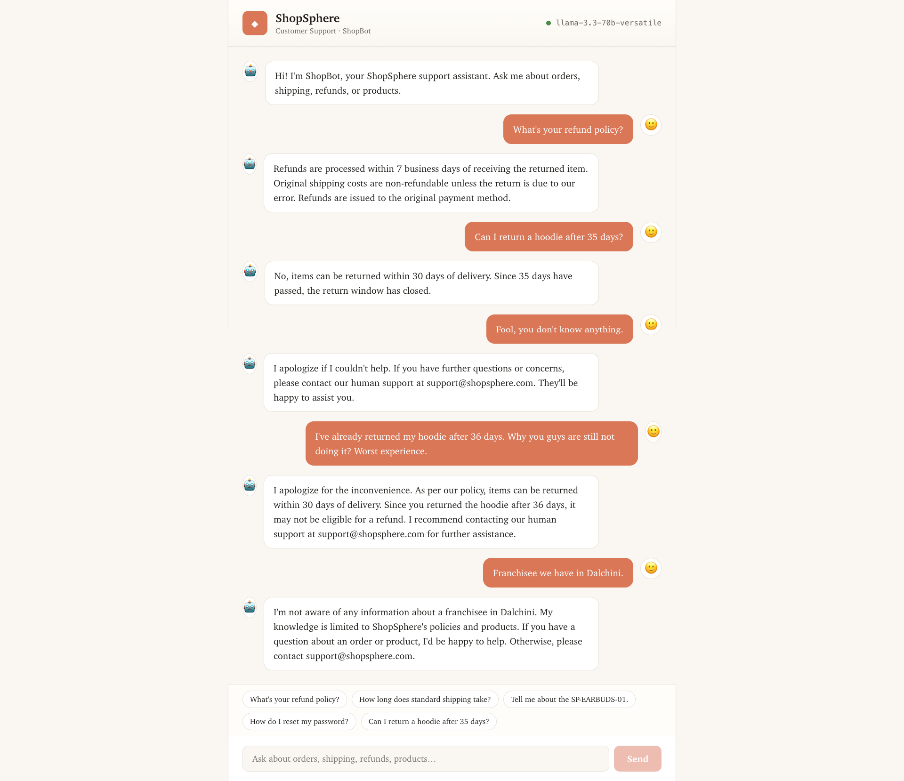
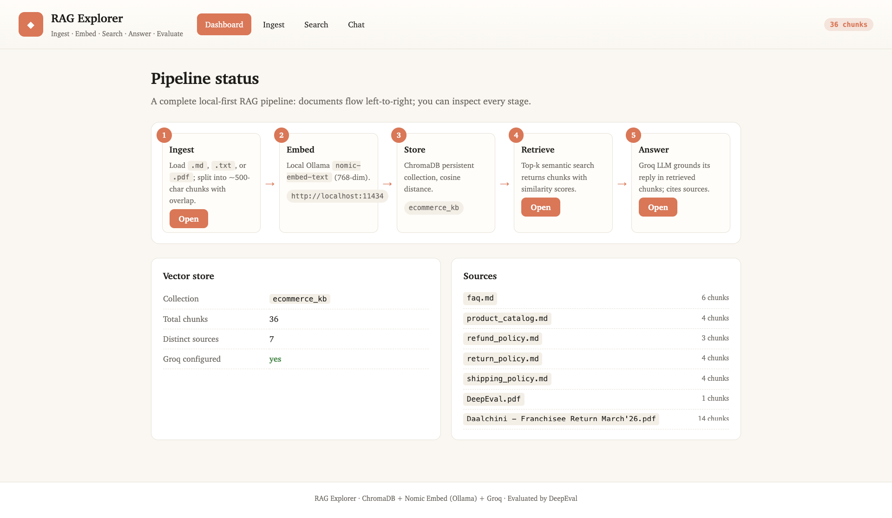
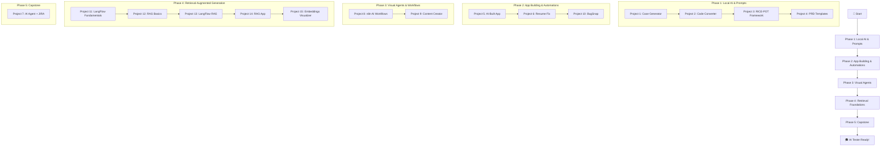

# 🤖 AI Tester Blueprint

<div align="center">


**A comprehensive hands-on course for QA Engineers to master AI-powered testing tools and techniques.**

*Learn to build local AI tools, prompt engineering frameworks, automation accelerators, AI agents, visual workflows, RAG systems, and full-stack applications—all with a tester-first mindset.*

---

[🚀 Getting Started](#-getting-started) • [📚 Projects](#-projects) • [🛠️ Tech Stack](#️-tech-stack) • [🎯 Learning Path](#-learning-path)

</div>

---

## 📖 About This Course

The **AI Tester Blueprint** is a project-based course designed to transform QA engineers into AI-powered testing professionals. Across **15 hands-on projects**, you'll progress from local LLM basics to building production-grade AI agents and robust document retrieval systems. Each project introduces new concepts in:

- 🧠 **Local LLM Integration** — Running AI models on your machine using Ollama
- 🏗️ **Prompt Engineering** — Crafting effective prompts using RICE-POT & B.L.A.S.T. frameworks
- 🔄 **Code Conversion** — Migrating legacy test suites to modern frameworks
- 📝 **Test Case Generation** — AI-assisted test case creation from user stories and PRDs
- 🤖 **AI Agents** — Building autonomous AI agents that integrate with JIRA & LLMs
- 🚀 **Full-Stack Dev with AI** — Using AI coding assistants (Claude Code) to build real apps
- 📄 **Resume & Career Tools** — AI-powered resume optimization for QA professionals
- 🔗 **No-Code Automation** — Visual workflow automation with n8n
- 📚 **Retrieval-Augmented Generation (RAG)** — Giving AI access to your private company data
- 🧩 **Flow Engineering** — Building visual AI apps with LangFlow

---

## 🚀 Getting Started

### Prerequisites

Before starting any project, ensure you have the following installed:

| Tool | Purpose | Installation |
|------|---------|--------------|
| **Ollama** | Local LLM Engine | [ollama.com](https://ollama.com/) |
| **Node.js** (v18+) | JavaScript Runtime | [nodejs.org](https://nodejs.org/) |
| **Python** (3.10+) | Backend Development | [python.org](https://python.org/) |
| **Java** (JDK 11+) | Selenium Projects | [adoptium.net](https://adoptium.net/) |
| **Maven** | Java Build Tool | [maven.apache.org](https://maven.apache.org/) |
| **n8n** | No-Code Automation | `npm install -g n8n` |
| **LangFlow** | Visual RAG Pipelines | `pip install langflow` |

### LLM Models Required

Pull the following models based on the project you're working on:

```bash
# For Project 1 - Test Case Generator
ollama pull llama3.2

# For Project 2 - Selenium to Playwright Converter
ollama pull codellama

# For Project 7 - TestPlan AI Agent (Local mode)
ollama pull llama3.2
```

---

## 📚 Projects

### 🔹 Project 1: Local Test Case Generator

> **AI-powered test case generation from User Stories using Llama 3.2**

| Aspect | Details |
|--------|---------|
| **Focus** | Test Case Generation, Prompt Engineering |
| **Tech Stack** | Python (FastAPI), Vanilla JS, Ollama |
| **LLM Model** | Llama 3.2 |
| **Key Concept** | B.L.A.S.T. Protocol for Agentic AI |

📂 **[View Project Details →](./Project_01_LocalTestCaseGenerator/README.md)**

---

### 🔹 Project 2: Selenium to Playwright Converter

> **AI-powered migration tool: Convert Selenium Java to Playwright TypeScript**

| Aspect | Details |
|--------|---------|
| **Focus** | Code Conversion, Legacy Migration |
| **Tech Stack** | React (Vite), Node.js, TailwindCSS, Monaco Editor |
| **LLM Model** | CodeLlama |
| **Key Concept** | Modern UI with Glassmorphism Design |

📂 **[View Project Details →](./Project_02_Selenium2PlaywrightLocalLLM/README.md)**

---

### 🔹 Project 3: RICE-POT Prompt Framework (Selenium)

> **Enterprise-grade Selenium framework generated using the RICE-POT prompting technique**

| Aspect | Details |
|--------|---------|
| **Focus** | Prompt Engineering, Framework Generation |
| **Tech Stack** | Java, Selenium, Maven, TestNG |
| **Key Concept** | RICE-POT Prompt Framework |
| **Target App** | Salesforce Login Page |

**RICE-POT Framework:**
**R**ole • **I**nstructions • **C**ontext • **E**xample • **P**arameters • **O**utput • **T**one

📂 **[View Project Details →](./Project_03_RICE_POT_PROMPT_SeleniumFramework/README.md)**

---

### 🔹 Project 4: Local LLM Prompt Templates

> **Production-ready prompt templates for test case generation from PRDs**

| Aspect | Details |
|--------|---------|
| **Focus** | Prompt Templates, PRD Analysis |
| **Tech Stack** | Playwright (TypeScript), Markdown Templates |
| **Key Concept** | Context-Constrained Prompting |

📂 **[View Project Folder →](./Project_04_LocalLLM_PROMPT_TEMPLATE/)**

---

### 🔹 Project 5: Job Board Assistant (AI-Built Full-Stack App)

> **A Kanban-style job application tracker — built entirely using Claude Code AI assistant**

| Aspect | Details |
|--------|---------|
| **Focus** | AI-Assisted Full-Stack Development |
| **Tech Stack** | React 19, TypeScript, Vite, Tailwind CSS 4 |
| **Key Concept** | Building production apps with AI coding assistants |

📂 **[View Project Details →](./Project_05_ClaudeCodeJobAssistantBoard/job-board-assistant/README.md)**

---

### 🔹 Project 6: AI Resume Fix for LinkedIn

> **AI-powered resume optimization tailored for QA/Testing professionals**

| Aspect | Details |
|--------|---------|
| **Focus** | Resume Optimization, Career Tools |
| **Tech Stack** | AI Prompts, DOCX/PDF Templates |
| **Key Concept** | AI-driven resume rewriting for QA roles |

📂 **[View Project Folder →](./Project_06_ResumeFix_LinkedIn/)**

---

### 🔹 Project 7: TestPlan AI Agent + JIRA Integration

> **Full-stack AI agent that automates test plan creation from JIRA tickets using LLMs**

| Aspect | Details |
|--------|---------|
| **Focus** | AI Agents, JIRA Integration, Full-Stack Development |
| **Tech Stack** | Node.js (Express), React (Vite), TypeScript, Tailwind CSS |
| **LLM Providers** | Groq API (Cloud) + Ollama (Local) |
| **Key Concept** | A.N.T. 3-Layer Architecture |

📂 **[View Project Details →](./Project_07_TestPlan_AI_AGENT_JIRA/AGENTS.md)**

---

### 🔹 Project 8: n8n AI Workflow Automation

> **Building multi-tool AI automation pipelines connecting APIs, Jira, and Google Sheets**

| Aspect | Details |
|--------|---------|
| **Focus** | No-Code AI Agents, Workflow Automation |
| **Tech Stack** | n8n, Groq API, Jira API, Google Docs/Sheets |
| **Key Concept** | Visual workflow automation for testers |

📂 **[View Project Folder →](./Project_08_n8n_Learning/)**

---

### 🔹 Project 9: Content Creation Agent (n8n)

> **Automated daily LinkedIn post generation and scheduling**

| Aspect | Details |
|--------|---------|
| **Focus** | Content Automation, Scheduled Workflows |
| **Tech Stack** | n8n, APIs |
| **Key Concept** | Task automation on a chronological schedule |

📂 **[View Project Folder →](./Project_09_Content-Creation-n8n/)**

---

### 🔹 Project 10: BugSnap

> **Enhancing bug reports with instant snapshots and annotations**

| Aspect | Details |
|--------|---------|
| **Focus** | Bug Reporting Tools |
| **Tech Stack** | Markdown, Web Technologies |
| **Key Concept** | Streamlined QA reporting flows |

📂 **[View Project Folder →](./Project_10_BugSnap-BugReportEnhancer/)**

---

### 🔹 Project 11: LangFlow Fundamentals

> **LangFlow basics, starter QA agents, and beginner visual AI pipelines**

| Aspect | Details |
|--------|---------|
| **Focus** | LangFlow Basics, Prompt Flows, QA Starter Agents |
| **Tech Stack** | LangFlow, Groq, Prompt Templates, API Request |
| **Key Concept** | Building simple visual AI flows before moving to RAG |

📂 **[View Project Folder →](./Project_11_LangFlow/)**

---

### 🔹 Project 12: RAG Basics (The Complete Guide)

> **Understanding and implementing all 10 types of Retrieval-Augmented Generation**

| Aspect | Details |
|--------|---------|
| **Focus** | AI Theory, RAG Architectures, Evaluative QA |
| **Tech Stack** | Python, LangChain, Markdown |
| **Key Concept** | Grounding AI responses in company documents |

📂 **[View Project Folder →](./Project_12_RAG_Basics/)**

---

### 🔹 Project 13: RAG with LangFlow

> **Visual implementations of RAG pipelines for test case generation**

| Aspect | Details |
|--------|---------|
| **Focus** | Low-code AI, Visual Node Programming |
| **Tech Stack** | LangFlow, AstraDB, Groq, Chroma |
| **Key Concept** | Drag-and-drop RAG pipeline engineering |

📂 **[View Project Folder →](./Project_13_RAG_with_LangFlow/)**

---

### 🔹 Project 14: RAG VIBE Coding App

> **A modular RAG application with upload, routing, ingestion, and chat interfaces**

| Aspect | Details |
|--------|---------|
| **Focus** | Full-stack RAG Application, Modular Retrieval |
| **Tech Stack** | FastAPI, ChromaDB, Python, Static HTML UI |
| **Key Concept** | Domain-routed document ingestion and answer generation |

📂 **[View Project Folder →](./Project_14_RAG_VIBE_CODING/)**

---

### 🔹 Project 15: Vector Embeddings Visualizer

> **Interactive chunking and embeddings playground for teaching vector search concepts**

| Aspect | Details |
|--------|---------|
| **Focus** | Embeddings, Chunking, Similarity, RAG Foundations |
| **Tech Stack** | FastAPI, Vanilla HTML/CSS/JS, Ollama/OpenAI/Mistral |
| **Key Concept** | Turning text into chunks, vectors, and a visible teaching-friendly map |

📂 **[View Project Folder →](./Project_15_Vector_Embeddings_Visualizer/)**

---

### 🔹 Project 16: Basic MCP Integrations

> **Learning how to build and communicate with Model Context Protocol (MCP) servers**

| Aspect | Details |
|--------|---------|
| **Focus** | Model Context Protocol, Server Creation |
| **Tech Stack** | Python, FastMCP, Playwright |
| **Key Concept** | Connecting local tools/resources securely to AI Assistants |

📂 **[View Project Folder →](./Project_16_MCP_Basic/)**

---

### 🔹 Project 17: Python AI Foundations

> **Core Python concepts tailored for building AI agents and workflows**

| Aspect | Details |
|--------|---------|
| **Focus** | Python Basics, Advanced Python, CrewAI Basics |
| **Tech Stack** | Python 3, CLI |
| **Key Concept** | Strong programmatic foundations for LLM orchestration |

📂 **[View Project Folder →](./Project_17_Python_AI/)**

---

### 🔹 Project 18: Crew AI Agents

> **Building complex multi-agent systems for QA processes**

| Aspect | Details |
|--------|---------|
| **Focus** | Multi-Agent Systems, JIRA integration, Automation |
| **Tech Stack** | Python, CrewAI, JIRA REST APIs |
| **Key Concept** | Autonomous task execution, memory, and specialized QA agents |

📂 **[View Project Folder →](./Project_18_CREW_AI_AGENT/)**

---

### 🔹 Project 19: MCP Creation AI Agent

> **Creating custom Model Context Protocol servers to expose proprietary QA tools**

| Aspect | Details |
|--------|---------|
| **Focus** | MCP Server Development, Exposing Resources & Prompts |
| **Tech Stack** | Python, FastMCP |
| **Key Concept** | Making dashboards, remote servers, and specific tools readable by AI |

📂 **[View Project Folder →](./Project_19_MCP_CREATION_AI_AGENT/)**

---

### 🔹 Project 20: LLM Evaluation with DeepEval (Foundations)

> **First taste of LLM evaluation: write pytest-style tests for a local Ollama LLM with DeepEval metrics**

| Aspect | Details |
|--------|---------|
| **Focus** | LLM Evaluation Foundations, Local Judges |
| **Tech Stack** | Python, DeepEval, Ollama |
| **Key Concept** | Treating LLM outputs as test cases — Answer Relevancy, Faithfulness, Hallucination |

📂 **[View Project Folder →](./Project_20_LLM_EVAL_SDET/)**

---

### 🔹 Project 21: DeepEval for SDET (Practical Lab)

> **Three-app lab: a Groq chatbot, a manual metric verifier, and a guided lesson-style verifier walking you through 9 metrics**

| Aspect | Details |
|--------|---------|
| **Focus** | Production-grade SDET patterns for LLM testing |
| **Tech Stack** | Python (FastAPI), Jinja2, Groq (Llama 4), OpenAI (GPT-4o-mini), DeepEval |
| **Key Concept** | Custom G-Eval metrics, threshold-based quality gates, regression suites |

📂 **[View Project Folder →](./Project_21_DeepEval_SDET/)**

---

### 🔹 Project 23: DeepEval Framework (Capstone)

> **Three independent subsystems + a live web dashboard: a React e-commerce chatbot, a full RAG Explorer (ChromaDB + Nomic Embed), and a 22-metric DeepEval framework with swappable judge LLMs (OpenAI / Groq / local Ollama)**

| Aspect | Details |
|--------|---------|
| **Focus** | End-to-end LLM evaluation framework with live dashboard |
| **Tech Stack** | React (Vite), FastAPI, ChromaDB, Ollama (`nomic-embed-text`), Groq, OpenAI, DeepEval, pytest |
| **Key Concept** | Provider-agnostic judge LLM via OpenAI-compatible APIs + `instructor`; 22 metrics covering quality, retrieval, safety, G-Eval, and conversational |

**Demo screenshots:**

| | |
|---|---|
|  |  |
| **DeepEval Dashboard** — live metric runs with pass/fail per card | **ShopSphere Chatbot** — React UI on top of Groq |
|  | |
| **RAG Explorer** — pipeline status from ingest through answer | |

📂 **[View Project Folder →](./Project_23_DeepEvAL_Framework/)**

---

## 🛠️ Tech Stack

<div align="center">

| Category | Technologies |
|----------|-------------|
| **AI/LLM** | Ollama, Llama 3.2, CodeLlama, Groq API, OpenAI |
| **Backend** | Python (FastAPI), Node.js (Express), TypeScript |
| **Frontend** | React 18/19, Vite, Vanilla JS, TailwindCSS, shadcn/ui |
| **Automation** | Selenium, Playwright, TestNG |
| **Integrations** | JIRA REST API v3, Groq SDK, Ollama SDK |
| **Storage** | SQLite, localStorage, AstraDB (Vector DB) |
| **Languages** | Python, JavaScript/TypeScript, Java |
| **Build Tools** | Maven, npm, Vite |
| **AI Assistants** | Claude Code, Ollama |
| **No-Code / Flow** | n8n, LangFlow |

</div>

---

## 🎯 Learning Path



---

## 📁 Repository Structure

```
AITesterBlueprint/
├── Project_01_LocalTestCaseGenerator/              # 🧪 AI Test Case Generator
├── Project_02_Selenium2PlaywrightLocalLLM/          # 🔄 Code Converter
├── Project_03_RICE_POT_PROMPT_SeleniumFramework/    # 🏗️ Selenium Framework
├── Project_04_LocalLLM_PROMPT_TEMPLATE/             # 📝 Prompt Templates
├── Project_05_ClaudeCodeJobAssistantBoard/           # 💼 Job Board app entirely built by AI
├── Project_06_ResumeFix_LinkedIn/                   # 📄 Resume Optimizer
├── Project_07_TestPlan_AI_AGENT_JIRA/               # 🤖 AI Agent + JIRA integrations
├── Project_08_n8n_Learning/                         # 🔗 n8n AI Workflows 
├── Project_09_Content-Creation-n8n/                 # 🗓️ Automated generic tasks scheduler
├── Project_10_BugSnap-BugReportEnhancer/            # 📸 Tool to easily annotate bugs
├── Project_11_LangFlow/                            # 🧩 LangFlow fundamentals and QA starter agents
├── Project_12_RAG_Basics/                          # 📚 Theory and definitions for 10 RAG architectures
├── Project_13_RAG_with_LangFlow/                   # 🔗 Visual RAG pipelines with LangFlow
├── Project_14_RAG_VIBE_CODING/                     # 🧠 Full-stack modular RAG app
├── Project_15_Vector_Embeddings_Visualizer/        # 📐 Embeddings + chunking visualizer
├── Project_16_MCP_Basic/                           # 🔌 MCP Basics
├── Project_17_Python_AI/                           # 🐍 Python AI Foundations
├── Project_18_CREW_AI_AGENT/                       # 🤖 CREW AI Agents
├── Project_19_MCP_CREATION_AI_AGENT/               # 🛠️ Custom MCP Servers
├── Project_20_LLM_EVAL_SDET/                       # 🧪 LLM Evaluation Foundations (DeepEval + Ollama)
├── Project_21_DeepEval_SDET/                       # 🔬 DeepEval Practical Lab (chatbot + verifier)
├── Project_23_DeepEvAL_Framework/                  # 🚀 Capstone: chatbot + RAG + 22-metric DeepEval dashboard
└── README.md                                      # 📖 This File
```

---

## 🤝 Contributing

We welcome contributions! To add a new project:

1. Create a new folder: `Project_NN_YourProjectName/`
2. Include a comprehensive `README.md`
3. Add a `BLAST.md` if following the B.L.A.S.T. protocol
4. Follow the established folder structure patterns
5. Update this main README with your project details

---

## 📜 License

This course material is part of the **AI Tester Blueprint** series.

---

## 👨‍💻 Author

**Pramod Dutta**  
*QA Automation Expert | AI Testing Advocate*

[](https://github.com/PramodDutta)

---

<div align="center">

**Built with ❤️ for the QA Community**

*Empowering testers to harness the power of AI — from local LLMs to autonomous agents*

</div>

---

## 📂 Detailed Project Contents

<details>
<summary><strong>Click to expand and explore the contents of each project folder</strong></summary>

### Project_00_LLM_Basics
Contains the core files and implementations for Project 00 LLM Basics.

```text
📁 Project_00_LLM_Basics/
    📄 LLMBasics.md
    📄 LLMBasicsTutorial.html
    📄 LLM_glossary.html
```

### Project_01_LocalTestCaseGenerator
Contains the core files and implementations for Project 01 LocalTestCaseGenerator.

```text
📁 Project_01_LocalTestCaseGenerator/
    📄 backend.log
    📄 frontend.log
    📄 progress.md
    📄 start_system.sh
    📄 task_plan.md
    📄 BLAST.md
    📄 README.md
    📄 .gitignore
    📄 findings.md
    📄 gemini.md
    📁 tools/
        📄 verify_ollama.py
        📄 .keep
        📄 generate_test_cases.py
    📁 frontend/
        📄 index.html
    📁 backend/
        📄 requirements.txt
        📄 app.py
    📁 architecture/
        📄 SOP_generate_test_cases.md
```

### Project_02_Selenium2PlaywrightLocalLLM
Contains the core files and implementations for Project 02 Selenium2PlaywrightLocalLLM.

```text
📁 Project_02_Selenium2PlaywrightLocalLLM/
    📄 server.js
    📄 B.L.A.S.T.md
    📄 progress.md
    📄 task_plan.md
    📄 README.md
    📄 .gitignore
    📄 package-lock.json
    📄 package.json
    📄 findings.md
    📄 gemini.md
    📁 ui/
        📄 tsconfig.node.json
        📄 index.html
        📄 tailwind.config.js
        📄 tsconfig.app.json
        📄 README.md
        📄 .gitignore
        📄 package-lock.json
        📄 package.json
        📄 tsconfig.json
        📄 eslint.config.js
        📄 vite.config.ts
        📄 postcss.config.js
        📁 public/
            📄 vite.svg
        📁 src/
            📄 App.tsx
            📄 main.tsx
            📄 App.css
            📄 index.css
            📁 assets/
                📄 react.svg
    📁 tools/
        📄 test_ollama.js
    📁 architecture/
        📄 1_prompt_engineering.md
```

### Project_03_RICE_POT_PROMPT_SeleniumFramework
Contains the core files and implementations for Project 03 RICE POT PROMPT SeleniumFramework.

```text
📁 Project_03_RICE_POT_PROMPT_SeleniumFramework/
    📄 pom.xml
    📄 README.md
    📄 .gitignore
    📄 testng.xml
    📁 target/
        📁 test-classes/
            📁 com/
                📁 salesforce/
                    📁 tests/
                        📄 LoginTest.class
                    📁 base/
                        📄 BaseTest.class
        📁 classes/
            📁 com/
                📁 salesforce/
                    📁 pages/
                        📄 LoginPage.class
    📁 src/
        📁 test/
            📁 java/
                📁 com/
                    📁 salesforce/
                        📁 tests/
                            📄 LoginTest.java
                        📁 base/
                            📄 BaseTest.java
        📁 main/
            📁 java/
                📁 com/
                    📁 salesforce/
                        📁 pages/
                            📄 LoginPage.java
```

### Project_04_LocalLLM_PROMPT_TEMPLATE
Contains the core files and implementations for Project 04 LocalLLM PROMPT TEMPLATE.

```text
📁 Project_04_LocalLLM_PROMPT_TEMPLATE/
    📄 Task2_BUG_Report.md
    📄 context_constraints.md
    📄 Product Requirements Document_ VWO Login Dashboard (1).pdf
    📄 package-lock.json
    📄 package.json
    📄 prd_content.txt
    📄 tsconfig.json
    📄 Task1_TC_PRD.md
    📄 playwright.config.ts
    📄 context_project.md_vwo.MD
    📁 src/
        📁 tests/
        📁 utils/
        📁 data/
        📁 pages/
            📄 BasePage.ts
```

### Project_05_ClaudeCodeJobAssistantBoard
Contains the core files and implementations for Project 05 ClaudeCodeJobAssistantBoard.

```text
📁 Project_05_ClaudeCodeJobAssistantBoard/
    📄 .gitkeep
    📁 job-board-assistant/
        📄 tsconfig.node.json
        📄 index.html
        📄 tsconfig.app.json
        📄 README.md
        📄 .gitignore
        📄 package-lock.json
        📄 package.json
        📄 tsconfig.json
        📄 eslint.config.js
        📄 vite.config.ts
        📄 postcss.config.js
        📁 dist/
            📄 index.html
            📄 vite.svg
            📁 assets/
                📄 index-8YDhLNMG.css
                📄 index-BovEhFqt.js
        📁 public/
            📄 vite.svg
        📁 src/
            📄 App.tsx
            📄 main.tsx
            📄 App.css
            📄 index.css
            📁 types/
                📄 index.ts
            📁 components/
                📄 JobCard.tsx
                📄 JobModal.tsx
                📄 Statistics.tsx
                📄 KanbanColumn.tsx
            📁 hooks/
                📄 useLocalStorage.ts
            📁 assets/
                📄 react.svg
```

### Project_06_ResumeFix_LinkedIn
Contains the core files and implementations for Project 06 ResumeFix LinkedIn.

```text
📁 Project_06_ResumeFix_LinkedIn/
    📄 Resume_FIX.zip
    📁 Resume_FIX/
        📄 Pramod_Dutta_Resume_PhysicsWallah_QA_Manager.docx
        📄 Pramod_Dutta_Resume_PhysicsWallah_QA_Manager.pdf
```

### Project_07_TestPlan_AI_AGENT_JIRA
Contains the core files and implementations for Project 07 TestPlan AI AGENT JIRA.

```text
📁 Project_07_TestPlan_AI_AGENT_JIRA/
    📄 progress.md
    📄 task_plan.md
    📄 BLAST.md
    📄 findings.md
    📄 gemini.md
    📄 AGENTS.md
    📁 intelligent-test-plan-agent/
        📄 .env.example
        📁 frontend/
            📄 tsconfig.node.json
            📄 index.html
            📄 tailwind.config.js
            📄 package-lock.json
            📄 package.json
            📄 tsconfig.json
            📄 vite.config.ts
            📄 postcss.config.js
            📁 public/
                📄 vite.svg
            📁 src/
                📄 App.tsx
                📄 main.tsx
                📄 index.css
                📁 components/
                    📄 MainLayout.tsx
                    📁 ui/
                        📄 tabs.tsx
                        📄 card.tsx
                        📄 slider.tsx
                        📄 toaster.tsx
                        📄 label.tsx
                        📄 switch.tsx
                        📄 badge.tsx
                        📄 button.tsx
                        📄 toast.tsx
                        📄 select.tsx
                        📄 textarea.tsx
                        📄 input.tsx
                    📁 forms/
                    📁 jira-display/
                📁 hooks/
                    📄 use-toast.ts
                📁 lib/
                    📄 utils.ts
                📁 pages/
                    📄 Settings.tsx
                    📄 Dashboard.tsx
                    📄 History.tsx
                📁 services/
                    📄 api.ts
        📁 backend/
            📄 package-lock.json
            📄 package.json
            📄 tsconfig.json
            📄 .env.example
            📁 src/
                📄 index.ts
                📁 database/
                    📄 schema.sql
                    📄 db.ts
                📁 utils/
                    📄 errors.ts
                    📄 validators.ts
                📁 routes/
                    📄 jira.ts
                    📄 settings.ts
                    📄 templates.ts
                    📄 llm.ts
                📁 services/
                    📄 jira-client.ts
                    📄 pdf-parser.ts
                    📄 secure-storage.ts
                    📁 {llm-providers}/
                    📁 llm-providers/
                        📄 ollama-provider.ts
                        📄 groq-provider.ts
        📁 prompt/
            📄 convertsion.md
        📁 templates/
            📄 2eb6683f-909b-45f8-becd-15a785d0f7ad-TestPlan.pdf
        📁 .tmp/
        📁 data/
            📄 app.db
            📄 7df37823-cafa-404e-94f1-e09c8ee44c2b.md
    📁 prompt/
        📄 prompt.md
    📁 templates/
        📄 TestPlan.pdf
```

### Project_08_n8n_Learning
Contains the core files and implementations for Project 08 n8n Learning.

```text
📁 Project_08_n8n_Learning/
    📄 AI_Batch_003_TestGen_Creator_Our_PRD_Excel.json
    📄 Testcase_GEN_prompt_AI_AGENT.md
    📄 JIRA AI Agent.json
    📄 .gitkeep
    📄 LF_RAG_TestCase_PDF_CSV_TC (2).json
    📄 README.md
    📄 AI_Batch_002_Test_PRD_JIRA_ID.md
    📄 AI_Batch_001.json
    📁 Project_01_Basic_AI_Chat/
        📄 README.md
    📁 Project_05_RAG_TestCase_LangFlow/
        📄 README.md
    📁 Project_04_Jira_AI_Agent/
        📄 README.md
    📁 Project_02_TestGen_PRD_Jira/
        📄 README.md
    📁 Project_03_TestGen_Excel_Export/
        📄 README.md
```

### Project_09_Content-Creation-n8n
Contains the core files and implementations for Project 09 Content-Creation-n8n.

```text
📁 Project_09_Content-Creation-n8n/
    📄 BLAST.md
    📄 idea.md
```

### Project_10_BugSnap-BugReportEnhancer
Contains the core files and implementations for Project 10 BugSnap-BugReportEnhancer.

```text
📁 Project_10_BugSnap-BugReportEnhancer/
    📄 repo.md
    📄 DB.json
```

### Project_11_LangFlow
Contains the core files and implementations for Project 11 LangFlow.

```text
📁 Project_11_LangFlow/
    📄 README.md
    📁 01_LangFlow_QuickStart/
        📄 jira_ticket_testplan_langflow.json
        📄 jira_story_score_html_agent_langflow.json
        📄 README.md
        📄 rice_pot_testcase_generator_langflow.json
        📄 pdf_to_json_agent_langflow.json
```

### Project_12_RAG_Basics
Contains the core files and implementations for Project 12 RAG Basics.

```text
📁 Project_12_RAG_Basics/
    📄 01_Introduction_to_RAG.md
    📄 README.md
    📁 02_Naive_Basic_RAG/
        📄 README.md
    📁 03_Advanced_RAG/
        📄 README.md
    📁 11_Contextual_RAG/
        📄 README.md
    📁 07_Self_RAG/
        📄 README.md
    📁 04_Modular_RAG/
        📄 README.md
    📁 08_Corrective_RAG/
        📄 README.md
    📁 09_Hybrid_RAG/
        📄 README.md
    📁 12_RAG_Evaluation/
        📄 README.md
    📁 10_MultiModal_RAG/
        📄 README.md
    📁 05_Graph_RAG/
        📄 README.md
    📁 06_Agentic_RAG/
        📄 README.md
    📁 RAG_Documents/
        📄 PRD_VWO.pdf
```

### Project_13_RAG_with_LangFlow
Contains the core files and implementations for Project 13 RAG with LangFlow.

```text
📁 Project_13_RAG_with_LangFlow/
    📄 12_Learning_Path.md
    📄 README.md
    📄 LangFlow_Tutorial.md
    📄 build_langflow_flows.py
    📁 05_Graph_RAG_Flow/
        📄 README.md
        📄 graph_rag_langflow.json
    📁 07_Self_RAG_Flow/
        📄 README.md
        📄 self_rag_langflow.json
    📁 09_Hybrid_RAG_Flow/
        📄 hybrid_rag_langflow.json
        📄 README.md
    📁 08_Corrective_RAG_Flow/
        📄 corrective_rag_langflow.json
        📄 README.md
        📄 corrective_rag_n8n_flow.json
    📁 11_Contextual_RAG_Flow/
        📄 contextual_rag_langflow.json
        📄 README.md
    📁 10_MultiModal_RAG_Flow/
        📄 README.md
        📄 multimodal_rag_langflow.json
    📁 03_Advanced_RAG_Flow/
        📄 02_Advance Rag.json
        📄 Advance RAG wiht Reranker_n8n.json
        📄 advanced_rag_langflow.json
        📄 README.md
        📄 advanced_rag_langflow_v6_fixed.json
        📄 advanced_rag_n8n_flow.json
    📁 06_Agentic_RAG_Flow/
        📄 agentic_rag_langflow.json
        📄 README.md
        📄 agentic_rag_n8n_flow.json
    📁 04_Modular_RAG_Flow/
        📄 modular_rag_langflow.json
        📄 README.md
    📁 02_Naive_RAG_Flow/
        📄 naive_rag_langflow.json
        📄 README.md
        📄 naive_rag_n8n_flow.json
```

### Project_14_RAG_VIBE_CODING
Contains the core files and implementations for Project 14 RAG VIBE CODING.

```text
📁 Project_14_RAG_VIBE_CODING/
    📄 requirements.txt
    📄 .env
    📄 app.py
    📁 ChromaDB_viewer/
        📄 README.md
        📄 app.py
    📁 rag/
        📄 generator.py
        📄 router.py
        📄 ingester.py
    📁 static/
        📄 index.html
    📁 temp_uploads/
```

### Project_15_Vector_Embeddings_Visualizer
Contains the core files and implementations for Project 15 Vector Embeddings Visualizer.

```text
📁 Project_15_Vector_Embeddings_Visualizer/
    📄 start_app.sh
    📄 README.md
    📄 .gitignore
    📄 .env.example
    📁 frontend/
        📄 index.html
    📁 backend/
        📄 requirements.txt
        📄 app.py
```

### Project_16_MCP_Basic
Contains the core files and implementations for Project 16 MCP Basic.

```text
📁 Project_16_MCP_Basic/
    📄 TASK.MD
    📁 Project_01_MCP_Playwright/
        📄 result.html
        📁 test_deliverables/
```

### Project_17_Python_AI
Contains the core files and implementations for Project 17 Python AI.

```text
📁 Project_17_Python_AI/
    📄 .env
    📁 python_basics/
        📄 09_IQ_LIST.py
        📄 20_OS.py
        📄 04_Multi_LineString.py
        📄 12_Tuple.py
        📄 17_Program_Understand.py
        📄 15_Concept_Type.py
        📄 03_Strings.py
        📄 18_Module_Imports.py
        📄 07_python_list.py
        📄 02_Variables_Data_Types.py
        📄 11_Dict.py
        📄 19_JSON.py
        📄 06_IF_ELSE.py
        📄 05_Strings.py
        📄 10_While_loop.py
        📄 01_Hello.py
        📄 13_Functions.py
        📄 14_Functons.py
        📄 21_CREW_AI.py
        📄 16_Lambda.py
        📄 08_Loop.py
    📁 utils_extra/
        📄 utils.py
```

### Project_19_MCP_CREATION_AI_AGENT
Contains the core files and implementations for Project 19 MCP CREATION AI AGENT.

```text
📁 Project_19_MCP_CREATION_AI_AGENT/
    📄 .gitkeep
    📄 KT.md
    📄 test_mcp_client.py
    📁 src/
        📄 01_HelloWorldCalculator_MCP.py
        📄 02_Weather_MCP.py
        📄 03_QA_Dashboard.py
        📄 04_QA_Dashboard_REAL_DATA.py
        📄 server.py
```

### Project_18_CREW_AI_AGENT
Contains the core files and implementations for Project 18 CREW AI AGENT.

```text
📁 Project_18_CREW_AI_AGENT/
    📄 003_ai_agent_memory.py
    📄 001_ai_agent_crew.py
    📄 .env
    📄 002_ai_agent_tools.py
    📄 llm_config.py
    📁 crewai/
        📄 01_hello_crewai.py
        📄 03_Building_QABugTriageCrew.py
        📄 bug_triage_report.html
        📄 06_FETCH_JIRA_CREATE_TEST_PLAN_AI_AGENT_Add_Memory.py
        📄 03_run_and_report.py
        📄 .gitignore
        📄 04_Custom_QA_Tools.py
        📄 .env
        📄 02_Research_Writer_AI_AGENT.py
        📄 05_FETCH_JIRA_CREATE_TEST_PLAN_AI_AGENT.py
        📁 output/
            📄 TestPlan_VWO-48_Memory_20260404.docx
            📄 TestPlan_VWO-48_20260404.docx
        📁 Task/
            📄 conftest.py
            📄 pytest.ini
            📄 __init__.py
            📄 .gitignore
            📁 assignment_1/
                📄 __init__.py
                📄 test_test_case_generator.py
                📄 test_case_generator_crew.py
            📁 assignment_2/
                📄 test_flaky_test_investigator.py
                📄 __init__.py
                📄 flaky_test_investigator_crew.py
            📁 assignment_3/
                📄 test_api_health_war_room.py
                📄 __init__.py
                📄 api_health_war_room_crew.py
    📁 learn/
        📁 chapter1/
            📁 test_planner/
                📄 uv.lock
                📄 report.md
                📄 pyproject.toml
                📄 README.md
                📄 .gitignore
                📄 .env
                📄 AGENTS.md
                📁 tests/
                📁 knowledge/
                    📄 user_preference.txt
                📁 src/
                    📁 test_planner/
                        📄 __init__.py
                        📄 crew.py
                        📄 main.py
                        📁 tools/
                            📄 __init__.py
                            📄 custom_tool.py
                        📁 config/
                            📄 agents.yaml
                            📄 tasks.yaml
        📁 chapter2/
            📁 test_plan_generator/
                📄 uv.lock
                📄 pyproject.toml
                📄 README.md
                📄 .gitignore
                📄 .env
                📄 AGENTS.md
                📁 tests/
                📁 knowledge/
                    📄 user_preference.txt
                📁 src/
                    📁 test_plan_generator/
                        📄 __init__.py
                        📄 crew.py
                        📄 main.py
                        📁 tools/
                            📄 __init__.py
                            📄 custom_tool.py
                        📁 config/
                            📄 agents.yaml
                            📄 tasks.yaml
        📁 chapter3/
            📁 bug_reporter/
                📄 uv.lock
                📄 pyproject.toml
                📄 README.md
                📄 .gitignore
                📄 .env
                📄 AGENTS.md
                📁 tests/
                📁 knowledge/
                    📄 user_preference.txt
                📁 src/
                    📁 bug_reporter/
                        📄 __init__.py
                        📄 crew.py
                        📄 main.py
                        📁 tools/
                            📄 __init__.py
                            📄 custom_tool.py
                        📁 config/
                            📄 agents.yaml
                            📄 tasks.yaml
        📁 chapter4/
            📁 rca_generator/
                📄 uv.lock
                📄 pyproject.toml
                📄 README.md
                📄 .gitignore
                📄 .env
                📄 AGENTS.md
                📁 tests/
                📁 knowledge/
                    📄 user_preference.txt
                📁 src/
                    📁 rca_generator/
                        📄 __init__.py
                        📄 crew.py
                        📄 main.py
                        📁 tools/
                            📄 __init__.py
                            📄 custom_tool.py
                        📁 config/
                            📄 agents.yaml
                            📄 tasks.yaml
    📁 KT/
        📄 003_ai_agent_memory.py
        📄 001_ai_agent_crew.py
        📄 002_ai_agent_tools.md
        📄 003_ai_agent_memory.md
        📄 002_ai_agent_tools.py
        📄 001_ai_agent_crew.md
```

</details>
