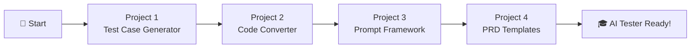

# 🤖 AI Tester Blueprint

<div align="center">


**A comprehensive hands-on course for QA Engineers to master AI-powered testing tools and techniques.**

*Learn to build local AI tools, prompt engineering frameworks, and automation accelerators—all running privately on your machine.*

---

[🚀 Getting Started](#-getting-started) • [📚 Projects](#-projects) • [🛠️ Tech Stack](#️-tech-stack) • [🎯 Learning Path](#-learning-path)

</div>

---

## 📖 About This Course

The **AI Tester Blueprint** is a project-based course designed to transform QA engineers into AI-powered testing professionals. Each project builds upon the previous, introducing new concepts in:

- 🧠 **Local LLM Integration** — Running AI models on your machine using Ollama
- 🏗️ **Prompt Engineering** — Crafting effective prompts for test automation
- 🔄 **Code Conversion** — Migrating legacy test suites to modern frameworks
- 📝 **Test Case Generation** — AI-assisted test case creation from user stories and PRDs

---

## 🚀 Getting Started

### Prerequisites

Before starting any project, ensure you have the following installed:

| Tool | Purpose | Installation |
|------|---------|--------------|
| **Ollama** | Local LLM Engine | [ollama.com](https://ollama.com/) |
| **Node.js** (v18+) | JavaScript Runtime | [nodejs.org](https://nodejs.org/) |
| **Python** (3.10+) | Backend Development | [python.org](https://python.org/) |
| **Java** (JDK 11+) | Selenium Projects | [adoptium.net](https://adoptium.net/) |
| **Maven** | Java Build Tool | [maven.apache.org](https://maven.apache.org/) |

### LLM Models Required

Pull the following models based on the project you're working on:

```bash
# For Project 1 - Test Case Generator
ollama pull llama3.2

# For Project 2 - Selenium to Playwright Converter
ollama pull codellama
```

---

## 📚 Projects

### 🔹 Project 1: Local Test Case Generator

> **AI-powered test case generation from User Stories using Llama 3.2**

| Aspect | Details |
|--------|---------|
| **Focus** | Test Case Generation, Prompt Engineering |
| **Tech Stack** | Python (FastAPI), Vanilla JS, Ollama |
| **LLM Model** | Llama 3.2 |
| **Key Concept** | B.L.A.S.T. Protocol for Agentic AI |

**What You'll Learn:**
- 🔒 Building privacy-first AI tools (no data leaves your machine)
- 📝 Structured output generation (JSON test cases)
- ⚡ Real-time UI with chat-like interface
- 🛠️ Deterministic tooling with Python

**Quick Start:**
```bash
cd Project1-LocalTestCaseGenerator
chmod +x start_system.sh
./start_system.sh
```

📂 **[View Project Details →](./Project1-LocalTestCaseGenerator/README.md)**

---

### 🔹 Project 2: Selenium to Playwright Converter

> **AI-powered migration tool: Convert Selenium Java to Playwright TypeScript**

| Aspect | Details |
|--------|---------|
| **Focus** | Code Conversion, Legacy Migration |
| **Tech Stack** | React (Vite), Node.js, TailwindCSS, Monaco Editor |
| **LLM Model** | CodeLlama |
| **Key Concept** | Modern UI with Glassmorphism Design |

**What You'll Learn:**
- 🔄 Automated code conversion patterns
- 🎨 Building beautiful developer tools
- 🔗 REST API design with Express proxy
- 📝 Monaco Editor integration for code input

**Quick Start:**
```bash
cd Project2-Selenium2PlaywrightLocalLLM
npm install
cd ui && npm install && cd ..
npm run dev
```

📂 **[View Project Details →](./Project2-Selenium2PlaywrightLocalLLM/README.md)**

---

### 🔹 Project 3: RICE-POT Prompt Framework (Selenium)

> **Enterprise-grade Selenium framework generated using the RICE-POT prompting technique**

| Aspect | Details |
|--------|---------|
| **Focus** | Prompt Engineering, Framework Generation |
| **Tech Stack** | Java, Selenium, Maven, TestNG |
| **Key Concept** | RICE-POT Prompt Framework |
| **Target App** | Salesforce Login Page |

**What You'll Learn:**
- 🏗️ Enterprise-level framework architecture
- 📋 Page Object Model with PageFactory
- 🎯 XPath-based locator strategies
- ⚙️ Robust exception handling patterns

**RICE-POT Framework:**

| Letter | Component | Purpose |
|:------:|-----------|---------|
| **R** | Role | Define AI persona |
| **I** | Instructions | Step-by-step commands & constraints |
| **C** | Context | Background information |
| **E** | Example | Code structure guidance |
| **P** | Parameters | Quality & accuracy constraints |
| **O** | Output | Exact artifacts to produce |
| **T** | Tone | Communication style |

**Quick Start:**
```bash
cd Project3-RICE_POT_PROMPT_SeleniumFrameowrk
mvn clean test
```

📂 **[View Project Details →](./Project3-RICE_POT_PROMPT_SeleniumFrameowrk/README.md)**

---

### 🔹 Project 4: Local LLM Prompt Templates

> **Production-ready prompt templates for test case generation from PRDs**

| Aspect | Details |
|--------|---------|
| **Focus** | Prompt Templates, PRD Analysis |
| **Tech Stack** | Playwright (TypeScript), Markdown Templates |
| **Key Concept** | Context-Constrained Prompting |
| **Target App** | VWO Platform |

**What You'll Learn:**
- 📄 Extracting test cases from Product Requirements Documents (PRDs)
- 🎯 Context and constraint file creation
- 📊 Test case categorization (Functional, Negative, Boundary, Edge)
- 🔐 Security and compliance testing patterns

**Includes:**
- `context_project.md` — Project context template
- `context_constraints.md` — Constraint definition template
- `Task1_TC_PRD.md` — PRD-to-test-case output example
- `Task2_BUG_Report.md` — Bug report template

📂 **[View Project Folder →](./Project4-LocalLLM_PROMOT_TEMPLATE/)**

---

## 🛠️ Tech Stack

<div align="center">

| Category | Technologies |
|----------|-------------|
| **AI/LLM** | Ollama, Llama 3.2, CodeLlama |
| **Backend** | Python (FastAPI), Node.js (Express) |
| **Frontend** | React, Vite, Vanilla JS, TailwindCSS |
| **Automation** | Selenium, Playwright, TestNG |
| **Languages** | Python, JavaScript/TypeScript, Java |
| **Build Tools** | Maven, npm |

</div>

---

## 🎯 Learning Path



### Recommended Order:

1. **Project 1** — Learn the basics of local LLM integration and test case generation
2. **Project 2** — Apply LLM skills to code conversion with a beautiful UI
3. **Project 3** — Master the RICE-POT prompt framework for enterprise code generation
4. **Project 4** — Create reusable prompt templates for real-world PRD analysis

---

## 📁 Repository Structure

```
AITesterBlueprint/
├── Project1-LocalTestCaseGenerator/     # 🧪 AI Test Case Generator
│   ├── backend/                         # FastAPI Backend
│   ├── frontend/                        # Vanilla JS UI
│   ├── tools/                           # Python Tools
│   └── architecture/                    # System Architecture
│
├── Project2-Selenium2PlaywrightLocalLLM/ # 🔄 Code Converter
│   ├── ui/                              # React Frontend
│   ├── tools/                           # Utility Scripts
│   └── server.js                        # Express Proxy
│
├── Project3-RICE_POT_PROMPT_SeleniumFrameowrk/ # 🏗️ Selenium Framework
│   ├── src/main/java/                   # Page Objects
│   ├── src/test/java/                   # Test Scripts
│   ├── pom.xml                          # Maven Config
│   └── testng.xml                       # TestNG Suite
│
├── Project4-LocalLLM_PROMOT_TEMPLATE/   # 📝 Prompt Templates
│   ├── src/                             # Playwright Tests
│   ├── context_project.md               # Project Context Template
│   ├── context_constraints.md           # Constraints Template
│   └── Task1_TC_PRD.md                  # Test Case Output
│
└── README.md                            # 📖 This File
```

---

## 🤝 Contributing

We welcome contributions! To add a new project:

1. Create a new folder: `ProjectN-YourProjectName/`
2. Include a comprehensive `README.md`
3. Follow the established folder structure patterns
4. Update this main README with your project details

---

## 📜 License

This course material is part of the **AI Tester Blueprint** series.

---

## 👨‍💻 Author

**Pramod Dutta**  
*QA Automation Expert | AI Testing Advocate*

[](https://github.com/PramodDutta)

---

<div align="center">

**Built with ❤️ for the QA Community**

*Empowering testers to harness the power of AI*

</div>
